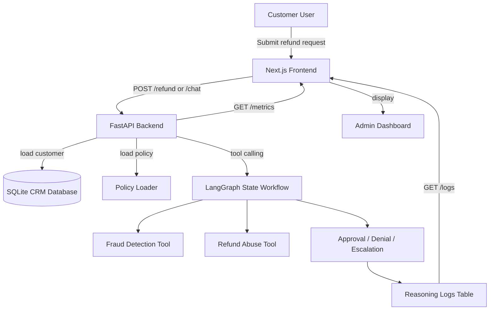

# Architecture Diagram

The WorkPodd AI Refund Agent solution is composed of three layers:

1. Frontend
   - Next.js app serves home, chat and admin dashboard pages.
   - React Query performs API requests for metrics, logs, customers and refund actions.

2. Backend
   - FastAPI exposes REST endpoints for customer chat, refund processing, CRM data and analytics.
   - SQLAlchemy and SQLite persist customers, refund requests, and reasoning logs.
   - A LangGraph-style state workflow orchestrates refund decision making.
   - OpenAI generates narrative explanations for final decisions.

3. Infrastructure
   - Docker Compose orchestrates frontend and backend containers.
   - `.env` configures environment variables for OpenAI and service URLs.

## Data Flow

- Customer submits a refund request from the frontend.
- Backend receives the request and executes the state graph.
- The workflow loads the customer, policy, and fraud/abuse checks.
- The agent approves, denies, or escalates the request.
- Every decision step is stored in reasoning logs.
- The admin dashboard displays metrics, recent activity, and audit trails.

## Architecture Diagram

